# API Flow and Sequence Diagrams

This document describes each exported API operation in [services/api.ts](../services/api.ts).

## 1) testConnection

### Flow Diagram
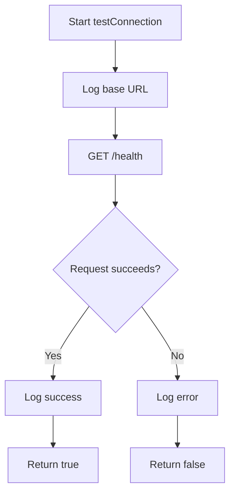

### Sequence Diagram
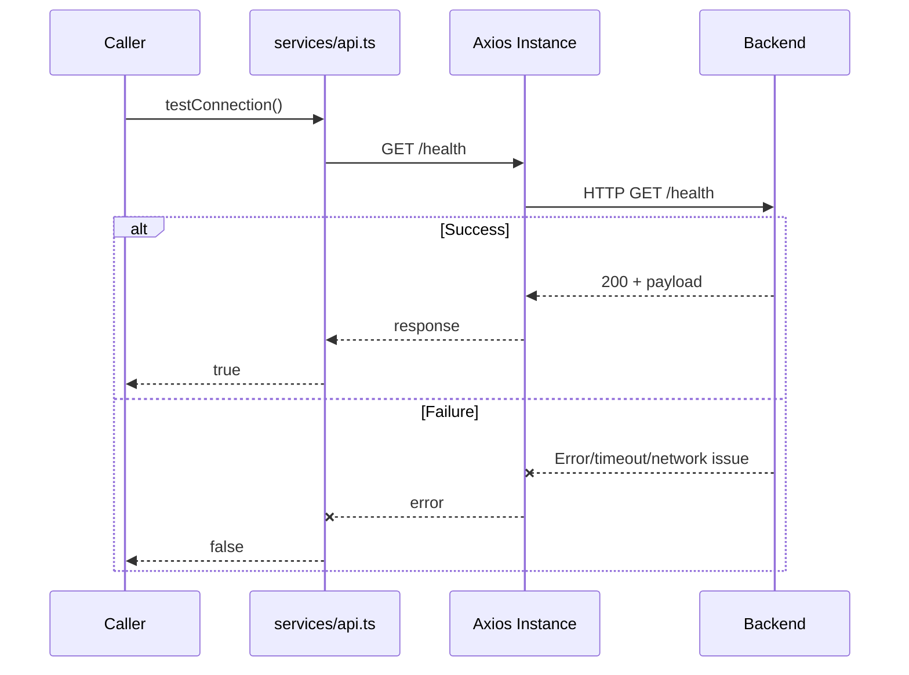

## 2) searchDogByText

### Flow Diagram
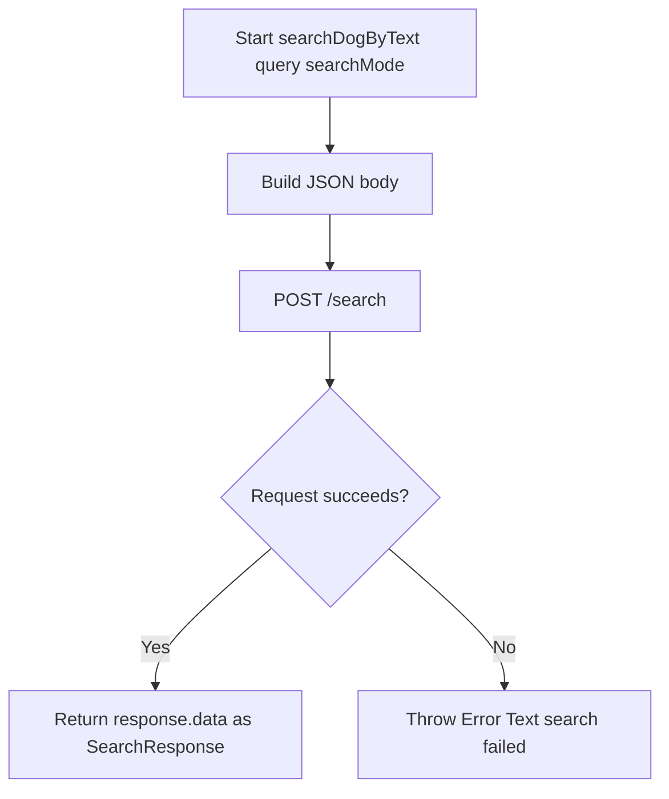

### Sequence Diagram
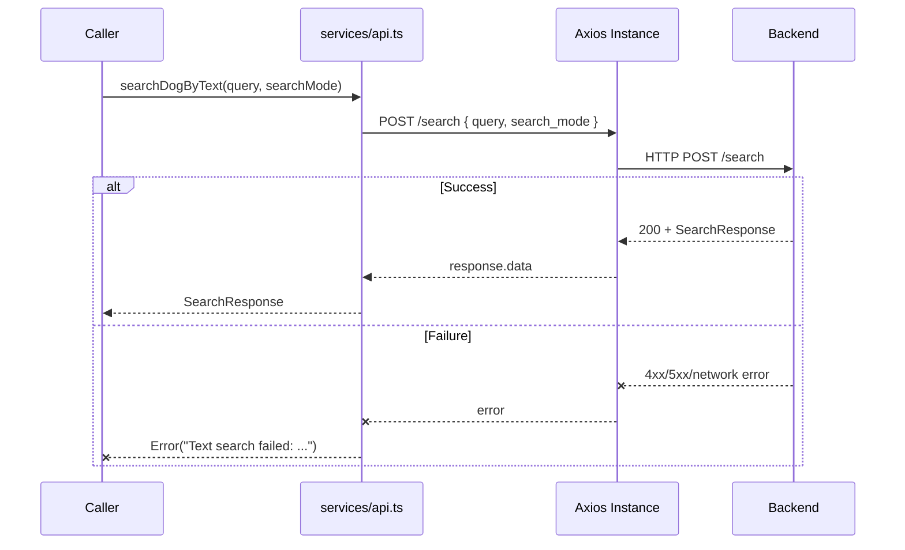

## 3) searchDogByImage

### Flow Diagram
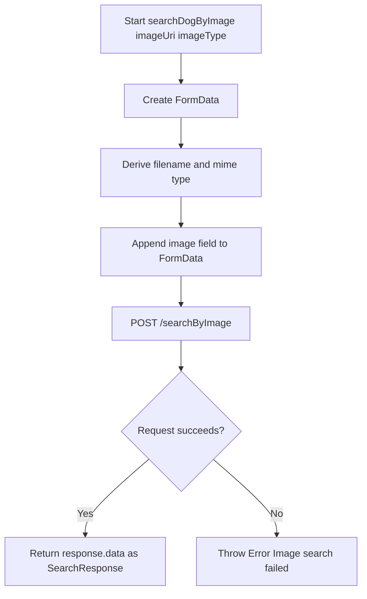

### Sequence Diagram
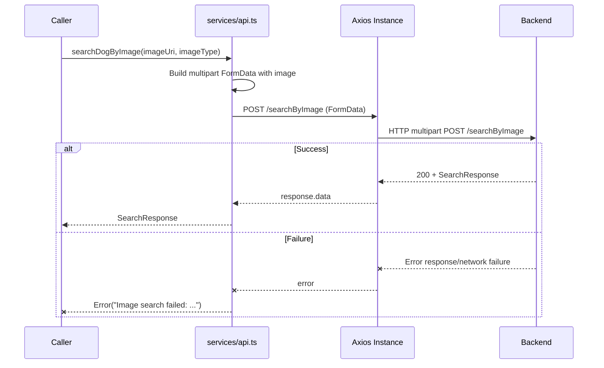

## 4) uploadDogImage

### Flow Diagram
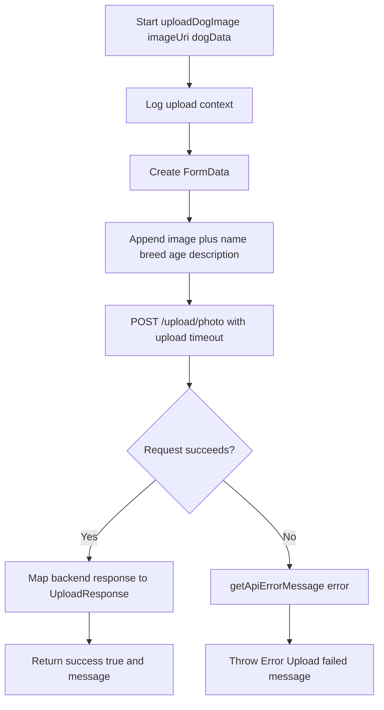

### Sequence Diagram
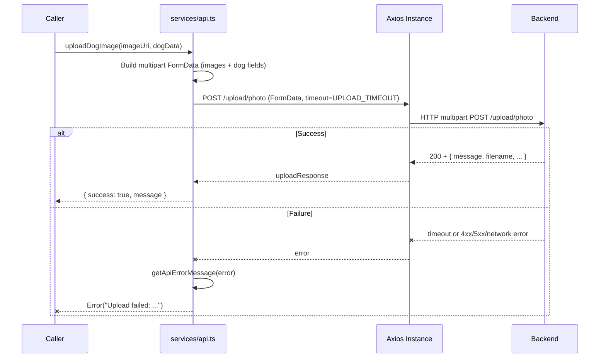

## 5) uploadMultipleDogImages

### Flow Diagram
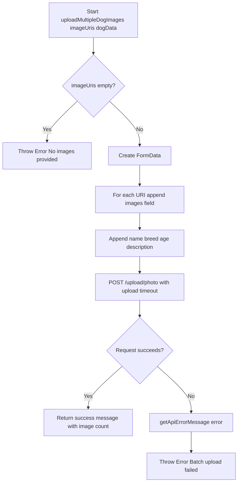

### Sequence Diagram
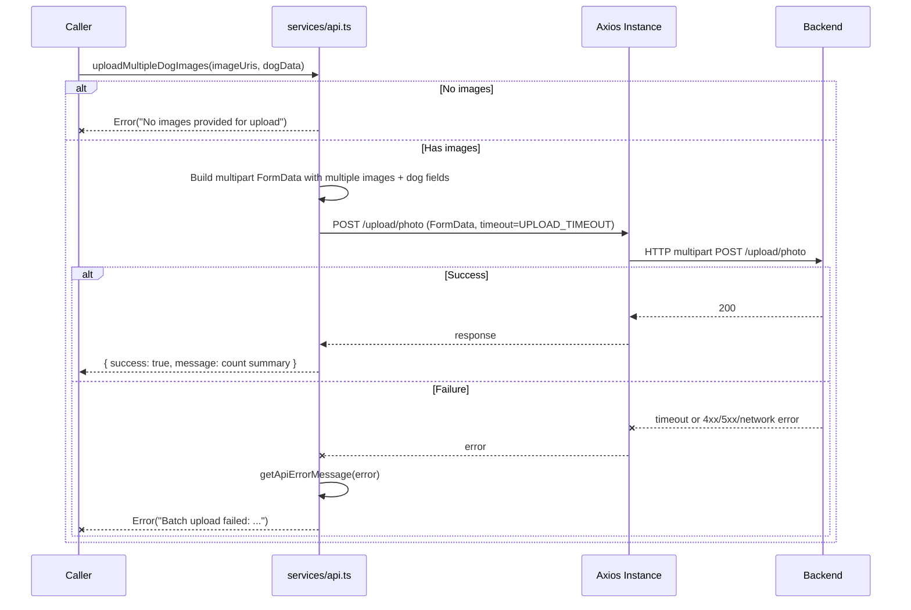

## 6) getAllDogs

### Flow Diagram
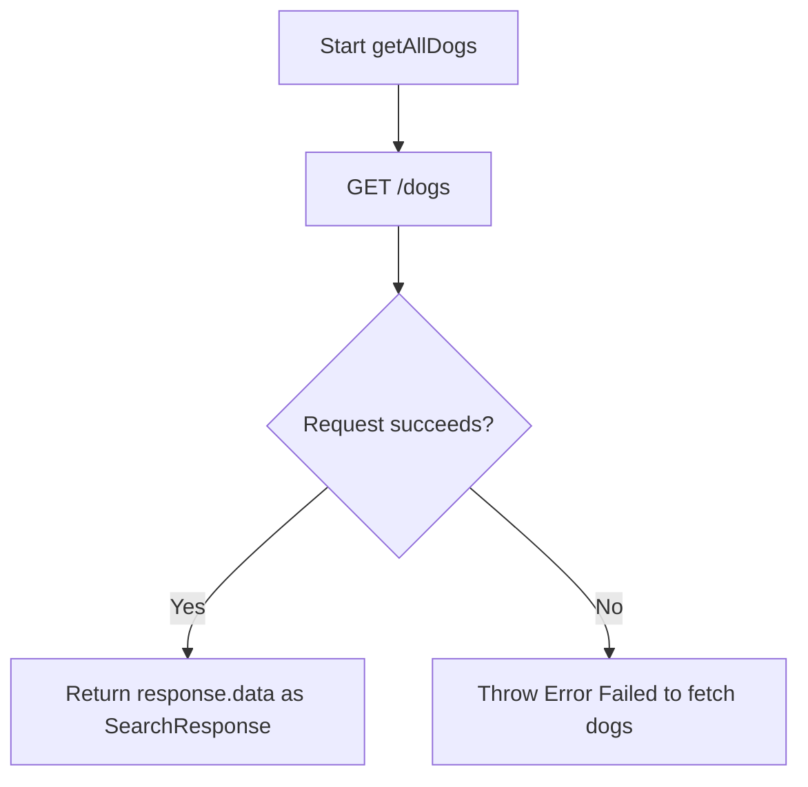

### Sequence Diagram
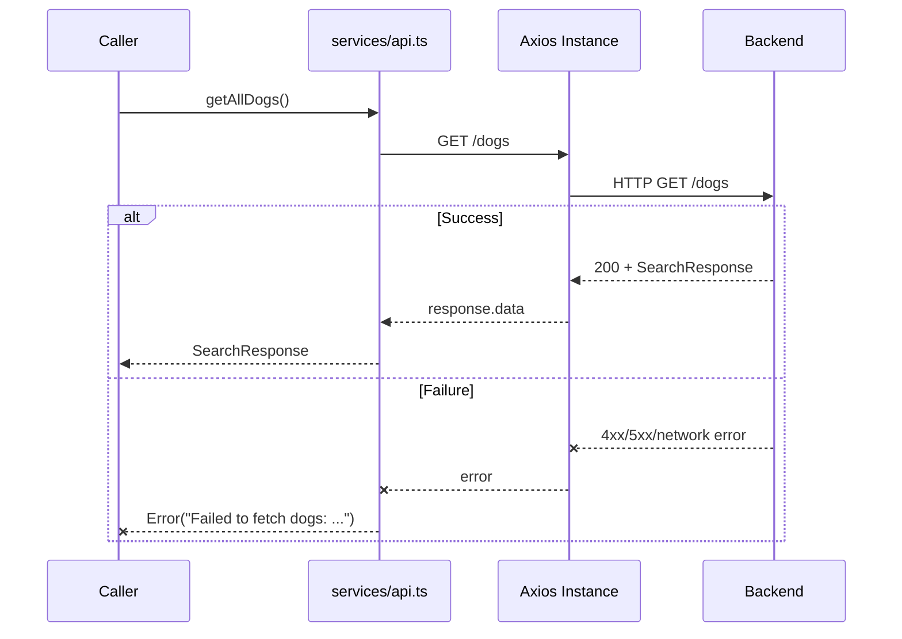

## Notes

- Base URL and endpoint constants are defined in [config/api.ts](../config/api.ts).
- Request and response interceptors in [services/api.ts](../services/api.ts) log traffic and propagate errors.
- Upload endpoints can run with no client timeout because `UPLOAD_TIMEOUT` is set to `0`.
